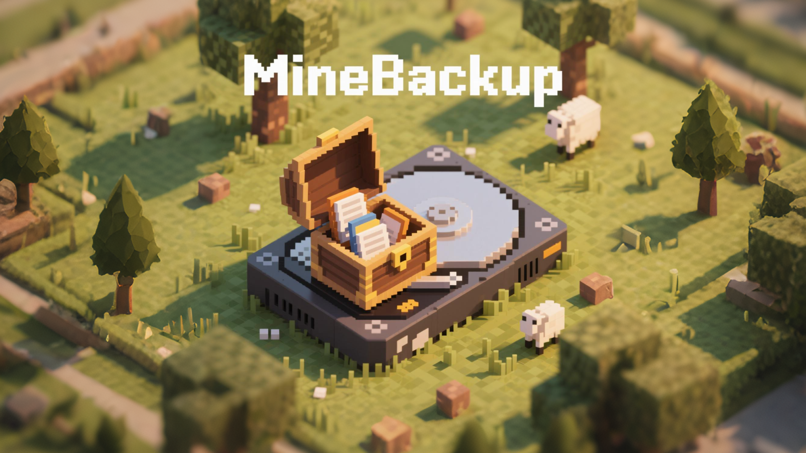

**中文** | [English](README.md) <!-- lang -->

# MineBackup - 存档时光机

存档时光机 是一款用户友好型应用程序，旨在帮助您轻松备份、恢复和导出Minecraft游戏存档文件文件，几乎适用于任何版本的Minecraft。
它独立于Minecraft游戏且小巧便捷，能够帮助你用最少的空间和最少的时间备份最多的回忆~

## 📸功能

- **图形界面**： 用户友好型~
- **备份**： 只需点击一下，即可备份你的游戏存档。
- **回档**： 从`.7z`文件直接回到备份时的状态。
- **高压缩**： 使用 7-Zip 压缩存档，节省电脑存储空间。
- **智能备份**: 可以仅备份存档相对变动部分，进一步节省空间。
- **自定义备份路径**： 根据存储偏好为备份设置自定义路径。

## ⚙️安装

1. **下载**： 到 [发布](https://github.com/Leafuke/MineBackup/releases) 中下载适用于 Windows 的单文件。
2. **双击运行**： 无需安装。

## 🗃️帮助

有关问题、功能请求，请到 [Issues](https://github.com/Leafuke/MineBackup/issues) 提交你的问题。 
你可以打开 [i18n.h](MineBackup/i18n.h) 来查看翻译和参与翻译的完善。 

## 🛠️自行编译指南

本代码编写的语言标准是C++17，你可以使用Visual Studio、VScode等进行编译。需要链接 imgui 库。

## 🔗KnotLink 互联通用信息

- `BACKUP`: BACKUP <config_idx> <world_idx> [comment]
- `RESTORE`: RESTORE <config_idx>
- `GET_CONFIG`: GET_CONFIG <config_idx>
- `LIST_WORLDS`: LIST_WORLDS <config_idx>
- `LIST_CONFIGS`: LIST_CONFIGS
- `GET_CONFIG`: GET_CONFIG <config_idx>
- `SET_CONFIG`: SET_CONFIG <config_idx> <key> <value>  
 key = backup_mode / hot_backup 
 value = 1/2/3     /  0/1

## 🔗项目延伸

[MineBackup for Netease](https://github.com/Leafuke/MineBackup-for-NetEase)
> 一个针对网易我的世界优化修改过后的 MineBackup

## 📄项目引用

[7-Zip](https://github.com/ip7z/7zip) (7-zip.org)
> 为 MineBackup 提供 7z.exe ，无需用户安装
[imgui](https://github.com/ocornut/imgui) 
> 为 MineBackup 提供图形库，简便易用！
KnotLink
> Who helps MineBackup to "communicate" with other programes
