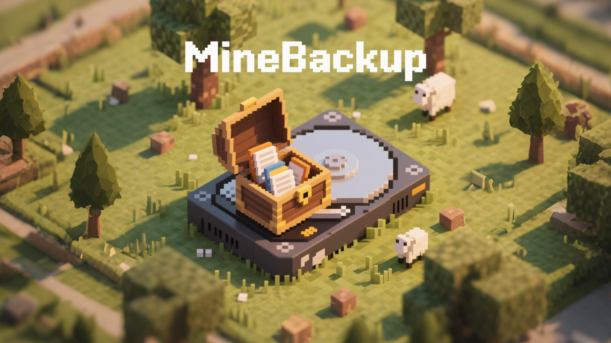

# MineBackup — 存档时光机 🗂️

[](https://github.com/Leafuke/MineBackup/releases)
[](https://github.com/Leafuke/MineBackup/issues)



> **轻松备份 · 快速还原 · 智能压缩**  
> 为你的 Minecraft 世界存档、游戏数据，甚至电脑上的任何文件夹提供一键保护。  


---

**写在前面**：

1.14.0 版本存在许多**破坏性更改**，升级到这个版本后，务必点击“工具”菜单栏中的“核心功能自动校验”来验证当前版本在你的电脑上能正常运行。并且，非常建议进行几次备份和还原测试，确保一切正常后再正式使用。

针对 Windows10 以上的用户，建议优先考虑 [FolderRewind](https://github.com/Leafuke/FolderRewind) + [MineRewind插件](https://github.com/Leafuke/FolderRewind-Plugin-Minecraft) 的组合——[二代时光机](https://github.com/Leafuke/FolderRewind)具有更现代的UI和更强大的功能，并且是将来主要的维护对象。不过考虑到已经有不少用户在使用它，所以我会继续维护 MineBackup，修复一些关键的 bug 和安全问题，但往往会滞后于二代时光机。

---

## ✨ 为什么选择 MineBackup？
- 🎯 **即点即用** — 单文件可执行，下载后双击运行，无需安装。
- 🖥 **简洁直观的 GUI** — 基于 ImGui，功能布局清晰、响应迅速。
- 💾 **安全备份** — 一键备份 Minecraft 存档，避免数据丢失。
- 🔄 **快速还原** — 支持从 `.7z` 文件或本地目录恢复任意版本。
- 📦 **高压缩率** — 内置 7-Zip 核心，节省存储空间。
- 🧠 **智能模式** — 类 Git 增量备份，节省时间与空间。
- 📁 **自定义路径** — 将备份保存到任意磁盘或外接设备。
- 🌏 **多语言支持** — 已支持中/英双语，欢迎贡献更多翻译。
- 💻 **多平台支持** — 目前支持 Windows、Linux 和 MacOS。

💡 **不仅仅是 Minecraft**：你可以用它来备份任何文件夹，完全不局限于游戏存档。

---

## 🚀 快速开始

### 1️⃣ 下载 & 运行
1. 前往 [最新发布页](https://github.com/Leafuke/MineBackup/releases)。
2. 下载适用于 Windows 的单文件版本。
3. 双击运行 — **就是这么简单**。

### 2️⃣ 基础操作
| 功能       | 操作方式 |
|------------|----------|
| 备份世界   | 在列表中选择世界 → 点击 **备份** |
| 还原世界   | 选择世界 → 点击 **还原**（可从 `.7z` 或本地目录恢复） |
| 修改备份路径 | 打开 **设置** → 选择备份存放位置 |
| 切换语言   | 设置 → 语言 |

### 3️⃣ 高级技巧
- 使用 **热键 Alt+Ctrl+S** 即可在游戏运行时触发“热备份”。
- 启用 **退出检测（DetectOnExit）**：自动在退出 Minecraft 后进行备份。
- 通过 **KnotLink** 与其他程序或 Mod 联动，实现备份前自动保存世界。示例 Mod 可见 [这里](https://modrinth.com/mod/minebackup)。

---

## 🛠 功能亮点

### 📌 热键备份
- 按 **Alt + Ctrl + S**：自动检测当前运行的世界 → 广播保存请求 → 执行热备份。

### 📌 热键还原
- **Alt + Ctrl + Z**：将你当前运行的世界还原到上一个备份版本！需要配合MineBackup-Mod联动模组。

### 📌 KnotLink 消息交互
通过 KnotLink 协议，MineBackup 可以与其他应用或 Mod 进行简单的文本消息通信。详情请参见 [MineBackup](https://modrinth.com/mod/minebackup) Mod。

- **支持的指令**：

待补充，可见 [MineBackup-Mod](https://github.com/Leafuke/MineBackup-Mod)

> 🔍 **开发者请看**：[KnotLink 协议详情](https://folderrewind.top/docs/plugins/knotlink)

---

## ⚙️ 安装与编译

**运行环境**：
- Windows 系统
- C++20 编译器
- 链接 ImGui 库
- 附带 7-Zip 

**编译步骤**：
```bash
# 克隆仓库
git clone https://github.com/Leafuke/MineBackup.git
cd MineBackup

# 使用 Visual Studio 打开并编译
````

---

## 代码签名策略

<table>
  <tr>
    <td>
      
    </td>
    <td>
    Free code signing on Windows provided by <a href="https://signpath.io">SignPath.io</a>, certficate by <a href="https://signpath.org/">SignPath Foundation</a>
    </td>
  </tr> 
</table>

- 由 [SignPath.io](https://about.signpath.io/) 提供免费代码签名，由 [SignPath Foundation](https://signpath.org/) 提供证书。
- 提交者和审阅者：[团队成员](https://github.com/Leafuke/MineBackup/graphs/contributors)
- 审批人：[Leafuke](https://github.com/Leafuke)

---

## 🤝 贡献与支持

* **报告问题 / 提交建议**：[GitHub Issues](https://github.com/Leafuke/MineBackup/issues)
* **多语言支持**：翻译 [`i18n.h`](MineBackup/i18n.cpp)，让更多玩家用上自己的语言。
* **文档改进**：访问 [官方文档](https://folderrewind.top) 提交改进建议。

---

## 📄 项目依赖

* [**7-Zip**](https://github.com/ip7z/7zip) — 压缩核心（7z.exe）
* [**ImGui**](https://github.com/ocornut/imgui) — GUI 框架
* [**stb**](https://github.com/nothings/stb) — 图片加载
* [**KnotLink**](https://github.com/hxh230802/KnotLink) — 程序间消息通信框架
* [**Font-Awesome**](https://github.com/FortAwesome/Font-Awesome) - Icons

---

**MineBackup** — 给你的 Minecraft 世界一份安心的保险。
💬 如果你喜欢它，请点一个 ⭐ 支持！
