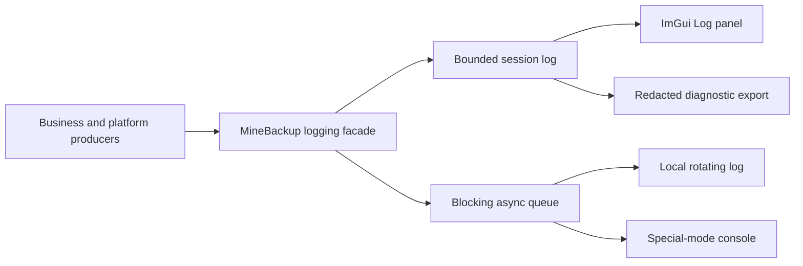

# Logging and diagnostics

MineBackup has one structured logging path for the GUI, background work,
special mode, platform integration and KnotLink. Business code emits records
through the MineBackup logging facade; only the logging implementation knows
about spdlog, and ImGui is a read-only consumer.

## Record contract

Every record has a globally increasing sequence, local timestamp, level,
category, stable event ID, localized UTF-8 message, session ID, producer thread,
source filename/line and structured context. The supported levels are Trace,
Debug, Info, Warning, Error and Critical; categories cover Application, Backup,
Restore, History, Cloud, Task, Process, Network, KnotLink, Migration, Platform
and Validation.

Messages are normalized before storage: CRLF becomes a single line break, ANSI
escapes and unsafe controls are removed, multiline output becomes separate
records and each line is limited to 64 KiB with an explicit truncation marker.
Formatting failures produce `logging.format_error` instead of throwing into
business code. Release builds omit Trace but retain Debug in the session log.

Use a stable dotted event ID for the event meaning, not for its translated
wording. Attach `operation_id`, `config_id`, `world`, `task` or `request_id`
through a scoped context. External stdout/stderr uses `LogRaw` at Debug; record
the final non-zero exit separately at Error. Never log a user Shell command
body, credential, rclone configuration file or token.

## Lifecycle and storage

MineBackup accepts up to 256 startup records before configuration is loaded.
After `LoadConfigs`, the selected file level decides whether those records are
replayed. The session log retains the newest 20,000 records and reports its
eviction count. Its sequence cursor lets the UI catch up without rescanning all
records.

The local file is `minebackup.log`, with a 10 MiB current file and four
archives (about 50 MiB total). It is UTF-8 and includes local ISO-8601 time and
timezone, sequence, session, level, category, thread, event ID, context and
source. A single worker drains an 8,192-record blocking queue. The backend
flushes every second; Error and Critical request an additional flush, and
normal shutdown drains the queue.

The file level is configured as `[General] LogFileLevel=off|info|debug` and
defaults to `info`. A legacy `AutoLog=0` maps to Off and `AutoLog=1` maps to
Info only when the new key is absent. Invalid values fall back to Info with a
warning. Saving writes only `LogFileLevel`; legacy `SilenceMode` has no runtime
meaning and is not written.

Changing the level at runtime drains and rebuilds the backend immediately. If
the directory is unwritable, the Log panel and special-mode console continue,
the status area reports the backend error once, and a non-recursive stderr or
debug-output fallback records the failure. `.active-session` exists only while
file logging is active. A leftover marker on the next launch produces an
“abnormal previous session” warning; normal shutdown removes it.

MineBackup no longer writes `auto_log.txt`, `special_mode_log.txt` or
`console_log.txt`. Existing copies are deliberately neither migrated nor
deleted.

## Log and command UI

The **Log** tab shows a clipped table with time, level, category and message.
Info and above are visible by default; Debug/Trace, category and full-text
filters are independent. Pause freezes only the view, not collection or file
output. Resume catches up from the sequence cursor. **Clear View** advances
that panel's cursor and does not delete session or file records.

The **Command** tab owns only input, completion and at most 100 history entries.
It is not a log store. Copying a row or filtered results is a local operation
and therefore keeps real local paths.

## Diagnostic export and privacy

Use **Export Diagnostics** in the **Log** tab. MineBackup first warns that arbitrary secrets
in external process output cannot be recognized. On confirmation it writes
`minebackup-diagnostics-YYYYMMDD-HHMMSS.txt` in the log directory and reveals
the file.

The export contains only the MineBackup version, platform, profile mode,
session/backend status and at most the 20,000 currently retained records. It
does not read or include configuration, history, rclone credential or other
user files. Before writing, longest matches are replaced for:

- the profile root, application root and user home;
- each configured save, backup, snapshot, external and WorldEdit root;
- local compression/rclone/font paths and configured task working directories;
- rclone remote paths;
- URL userinfo and query parameters.

Local rotating logs intentionally keep real paths for troubleshooting. Always
open and review a diagnostic export before sharing it.

## Platform locations and verification

The log root follows [AppPaths](data-and-migration.md):

- Windows: `%LOCALAPPDATA%\MineBackup\logs`;
- Linux: `${XDG_STATE_HOME:-~/.local/state}/MineBackup/logs`;
- macOS: `~/Library/Logs/MineBackup`;
- explicit/portable profiles: `<profile>/logs`.

For each release platform, verify that Info is the default, Off creates no
file, Debug takes effect without restart, 10 MiB rotation stays within five
files, a read-only destination leaves the UI usable, forced termination is
reported on restart, and normal exit is not. Windows artifacts must not depend
on a spdlog/fmt DLL. Linux and macOS dependency checks likewise must show no
new logging runtime library.

Automated coverage includes formatting/sanitization, startup replay, runtime
reconfiguration, 100,000 records from four producer threads, blocking-queue
drain, rotation ordering, session eviction, backend failure, marker lifecycle,
bilingual printf formats and diagnostic redaction.
